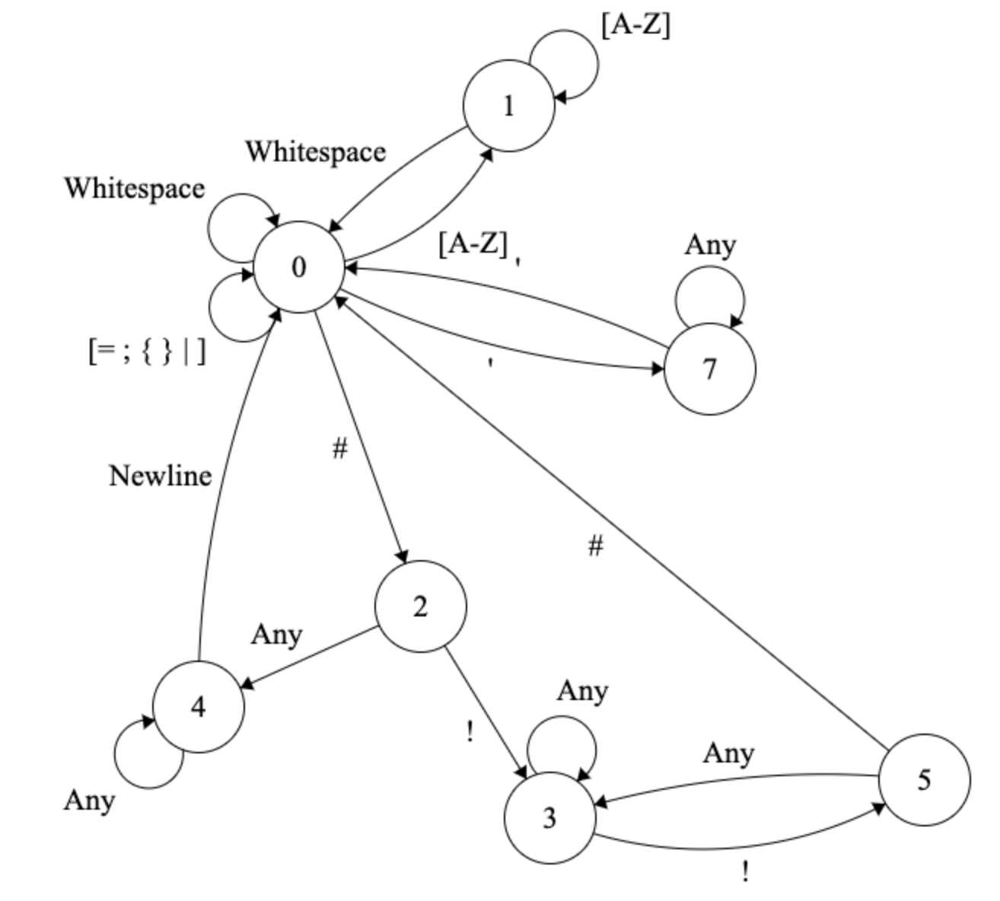
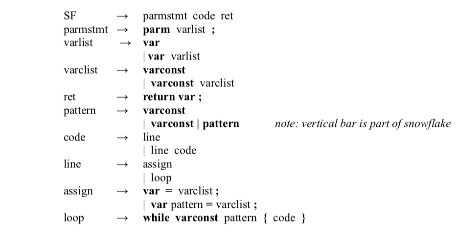

# SnowFlake Parser 
## COMP 360 Programming Languages

---
### The Following is the Finite State Automata for the Snowflake language

---
### The Following are the Reproduction rules in BNF form for the Parse Tree

